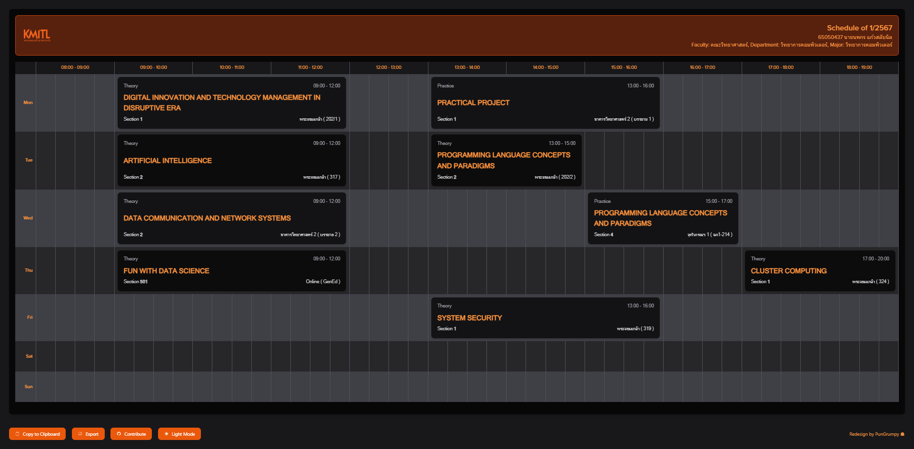
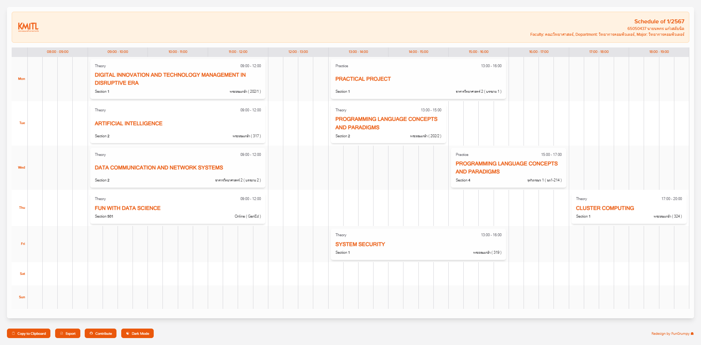

<div align="center">
    <h1>🧙‍♂️ KMITL Wizard Extension Chrome</h1>
    <p>
        <sub>A schedule table extension for KMITL students</sub>
    </p>
    <table>
        <tr>
            <td>
                
                <p align="center">
                    Preview in dark mode
                </p>
            </td>
            <td>
                
                <p align="center">
                    Preview in light mode
                </p>
            </td>
        </tr>
    </table>
</div>

## 🔮 Features

- [x] Display schedule table
- [x] Display address of the classroom
- [x] Display time of the class
- [x] Download schedule table as an image
- [x] Copy schedule table to clipboard
- [x] Dark mode

## 🧑‍💻 Stacks

- [Svelte](https://svelte.dev/)
- [TypeScript](https://www.typescriptlang.org/)
- [Vite](https://vitejs.dev/)
- [CRXJS Vite Plugin](https://github.com/crxjs/chrome-extension-tools/blob/main/packages/vite-plugin/README.md)
- [Chrome Extensions Manifest V3](https://developer.chrome.com/docs/extensions/mv3/intro/)
- [Tailwind CSS](https://tailwindcss.com/)

## 🚜 Development

To get started with development, follow these steps:

1. **Install dependencies:**

   ```bash
   bun install
   ```

2. **Start development server with HMR (Hot Module Replacement):**

   ```bash
   bun dev
   ```

## ⚙️ Build

To create a production build, run:

```bash
bun run build
```

This will compile the files into the `/dist` directory.

## 📦 Load Unpacked Extensions

To load the extension into Chrome, follow these steps:

1. Open the Extension Management page by navigating to `chrome://extensions`.
2. Enable Developer Mode by clicking the toggle switch next to **"Developer mode"**.
3. Click the **"LOAD UNPACKED"** button and select the `/dist` directory.
4. For easier development, install the [Extensions Reloader](https://chromewebstore.google.com/detail/extensions-reloader/fimgfedafeadlieiabdeeaodndnlbhid) for automatic updates to `/dist`.

## 🤝 Contribute

We invite you to contribute to KMITLX! Here’s how you can help:

- Open a pull request. We will review your code and approve it if it meets our standards. 😎
- Report a bug by opening an issue. 🐛
- Add a new feature by opening an issue. 💡

## 🫡 Credits

This project is inspired by:

- [Svelte Typescript Chrome Extension Boilerplate](https://github.com/NekitCorp/chrome-extension-svelte-typescript-boilerplate)
- [KMITL +](https://github.com/t0ngk/KMITL-PLUS)
- [KMITL X](https://github.com/BossNz/kmitl-x)

## 📄 License

This project is licensed under the MIT License - see the [LICENSE](LICENSE) file for details.
